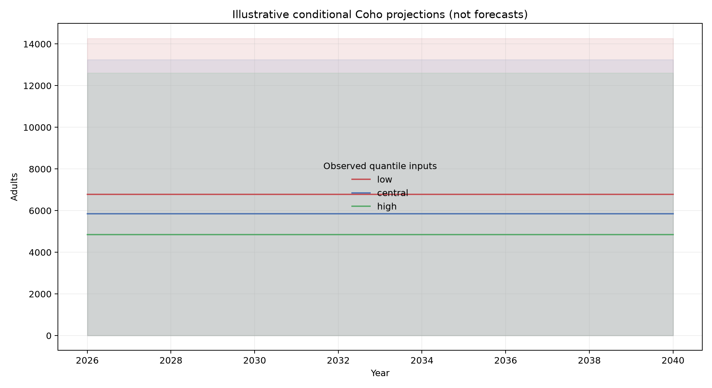
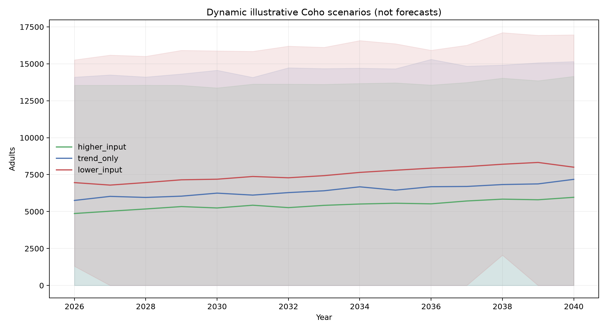

# Issaquah Creek salmon study — awareness report

## Executive summary

This study describes annual Chinook and Coho returns at Issaquah Hatchery from 1997–2025 and tests associations with measured flow, grab-sample temperature, snowpack, and PDO. Results are decision-support evidence, not causal estimates or certain forecasts.

Neither species showed a statistically significant monotonic total-adult trend after the pre-specified multiple-testing adjustment. Environmental indicators did change over the period: April 1 snowpack declined, warm-season temperature increased, and PDO shifted. Those trends do not demonstrate that any indicator caused salmon-return variation.

## Data and collection sources

The response series comes from Washington Department of Fish and Wildlife's public Hatchery Adult Salmon Returns event dataset. Annual total adults are the sum of `Trap Estimate` adult counts for Issaquah Creek stock at Issaquah Hatchery, with Chinook and Coho analyzed separately. Wild-origin counts are reported only from 2010 onward because earlier records do not contain comparable explicit wild rows.

Environmental inputs were assembled from USGS station 12121600 discharge records, King County water-quality grab-sample temperatures at station 0631, NRCS SNOTEL station 788 April 1 snow-water equivalent, and NOAA Pacific Decadal Oscillation data. The King County terrain-derived Issaquah Creek basin feature was used locally as the analytical boundary, but its raw polygon is not redistributed because of provider terms.

RMIS release data could not be collected without authorization, and an annual impervious-surface series was not available in a distributable form. Both fields were retained as documented missing variables rather than zero-filled or imputed.

## Model used

The modeling response is `log1p(total_adults)`, back-transformed to adult counts for reporting errors. The candidate models are small linear association models: migration-period flow, temperature, and PDO; cohort-year flow, snowpack, and PDO; and a five-feature ridge model combining those predictors. Predictors are standardized within each training fold. Expanding-window validation trains only on earlier years and tests one subsequent year, with expanding-mean and previous-year baselines.

The three retained Coho candidates improved both MAE and RMSE over the best naive baseline. No Chinook candidate did. These are observational association models, not causal models.

## How the dynamic projections were produced

For each retained Coho model, each environmental input was extrapolated from its observed 1997–2025 Theil–Sen trend through 2040. Three input paths were generated: `higher_input`, `trend_only`, and `lower_input`; these labels describe input direction, not whether conditions are biologically favorable. Reproducible annual residual variation was added using historical trend residuals. Held-out Phase 4 salmon-return residuals were then sampled in 1,000 simulations per year. The plotted median and 90% simulation range are the ensemble of the three retained models.

These projections are dynamic sensitivity illustrations. They are not authoritative climate projections, management forecasts, or calibrated prediction intervals. PDO is treated as an external uncertain input; hatchery releases and imperviousness remain implicitly constant because they are unavailable.

## Predictive evidence

Six interpretable association models and two naive comparators were evaluated using 17 expanding-window validation years. Three Coho candidates improved on both naive error measures; no Chinook candidate did. The retained Coho models have wide bootstrap uncertainty, and their empirical held-out intervals covered 88.2% of test years. This is insufficient to claim calibrated forecasting intervals.

## Conditional illustrations

The Phase 6 outputs show 2026–2040 Coho sensitivity under constant predictor values at the observed 10th, 50th, and 90th percentiles from 1997–2025. They are illustrative conditional projections, not forecasts, climate projections, or policy-effect estimates. PDO is external uncertainty, not a controllable lever.

## Important limitations

- Hatchery release records could not be obtained because RMIS access requires authorization; releases remain an unmeasured confounder.
- Basin imperviousness was not available in a distributable analytical series and was excluded.
- Temperature is a seasonal grab-sample index, not continuous exposure.
- The watershed polygon is locally retained under provider redistribution restrictions.
- Wild-origin records are explicitly comparable only from 2010 onward.
- No domain-partner review has been completed; factual interpretation should be reviewed before public release.

## Recommended use

Use the results to prioritize data improvements and questions for local partners, not to set numeric harvest, restoration, hatchery, or land-use targets. The highest-value next step is obtaining authorized release data and expert review, followed by rerunning the locked pipeline.

## Detailed evidence in one place

### Observed trends

| Result | Finding |
|---|---|
| Chinook total adults | Kendall tau -0.118; BH-adjusted p=0.857; no significant monotonic trend |
| Coho total adults | Kendall tau -0.044; BH-adjusted p=0.857; no significant monotonic trend |
| April 1 SWE | Declining trend; BH-adjusted p=0.025 |
| Warm-season temperature | Increasing trend; BH-adjusted p=0.025 |
| Annual PDO | Trend detected; BH-adjusted p=0.027 |

### Predictive validation

Each species had 17 rolling-origin test years (2009–2025). The best Chinook comparator was previous-year persistence (MAE 1,180; RMSE 1,414), and no environmental model beat it. Three Coho models beat both naive baselines: all-environment ridge (MAE 3,620; RMSE 4,285), freshwater/marine OLS (MAE 3,857; RMSE 4,805), and migration/marine OLS (MAE 3,713; RMSE 4,878). These results indicate limited and species-specific predictive skill, not causal effects.

### Uncertainty and dynamic projections

Bootstrap 95% intervals around the 17 held-out errors were wide. Empirical residual intervals covered 88.2% of held-out years for each retained Coho candidate, so nominal 95% calibration is not established. The dynamic 2026–2040 illustrations use 1,000 simulations per model and year, extrapolating observed Theil–Sen environmental trends with annual residual variation and held-out salmon-return residuals. They provide higher-input, trend-only, and lower-input paths; they should be read as conditional sensitivity ranges, not expected counts.

#### Projection figures

Historical-quantile sensitivity benchmark:

Dynamic trend-and-variability illustration:

The audit trail remains available in the phase-specific reports and tables referenced below, but the principal findings and limitations are summarized here for reviewers.

Detailed evidence files are `docs/eda_report.md`, `docs/statistical_analysis_report.md`, `docs/phase5_uncertainty_report.md`, `docs/phase6_scenario_report.md`, and `docs/phase6_dynamic_report.md`.
